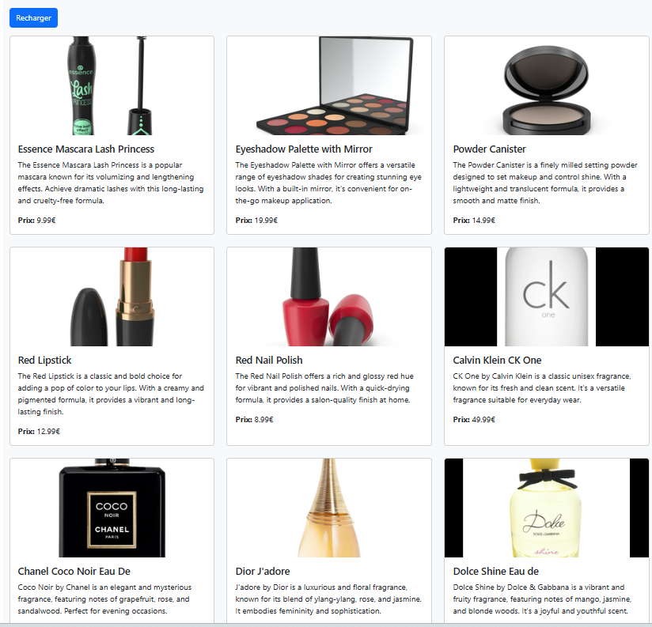
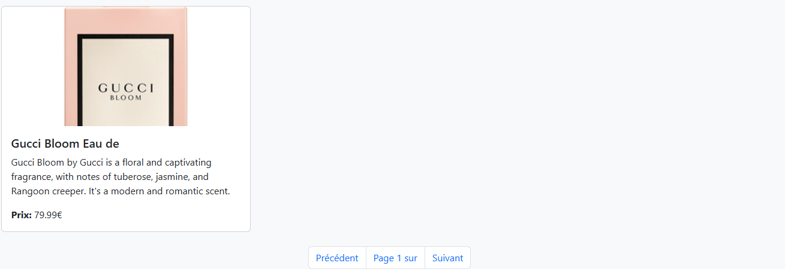

---

#  React Hooks - Application de Gestion de Produits

---
Objectif de mettre en pratique l'utilisation des Hooks React (`useState`, `useEffect`, `useContext`) ainsi que la création de Hooks personnalisés. Voici les détails des exercices et les solutions proposées.

## **-État et Effets**

### **Objectif**
Gérer l'état des produits et utiliser `useEffect` pour charger les données initiales.

### **Solution**
- Utilisation de `useState` pour stocker la liste des produits.
- Utilisation de `useEffect` pour charger les produits depuis une API.

### **-Capture d'écran**

---

## **Exercice 2 : Context et Internationalisation**

### **Objectif**
Gérer les préférences de langue avec `useContext`.

### **Solution**
- Création d'un `LanguageContext` pour partager la langue dans toute l'application.
- Ajout d'un sélecteur de langue dans l'en-tête.

### **-Capture d'écran**

---

## Exercice 3 : Hooks Personnalisés

### Objectif
Créer des hooks réutilisables (`useDebounce` et `useLocalStorage`).

### Solution
- `useDebounce` : Retarde la recherche pour éviter des appels API excessifs.
- `useLocalStorage` : Persiste les préférences utilisateur (thème).

### -Captures d'écran

---

## **Exercice 4 : Gestion Asynchrone et Pagination**

### **Objectif**
Gérer le chargement asynchrone des produits et implémenter la pagination.

### **Solution**
- Ajout d'un bouton de rechargement pour rafraîchir la liste des produits.
- Implémentation de la pagination avec des boutons "Précédent" et "Suivant".

### **-Capture d'écran**

---

